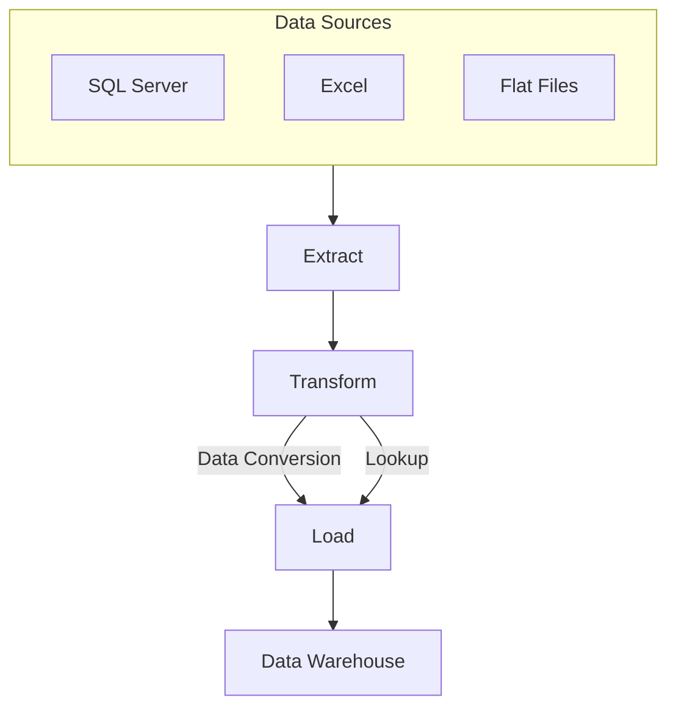
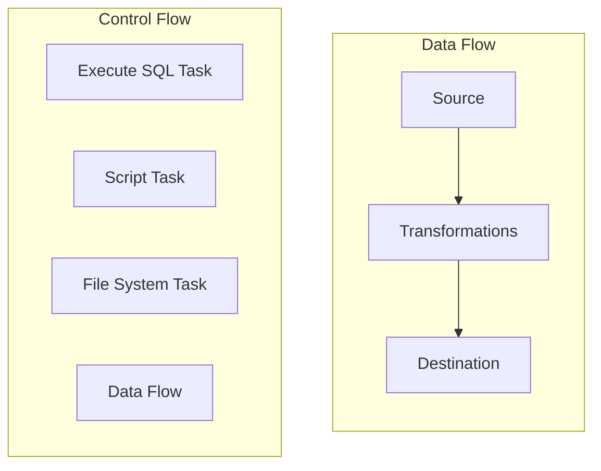
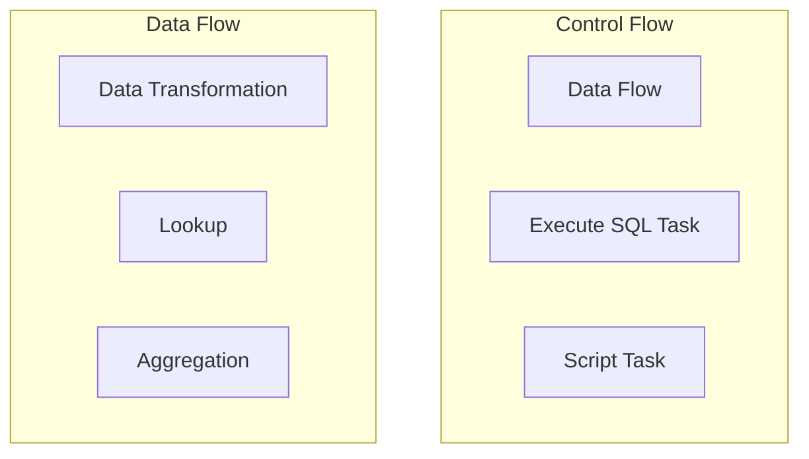
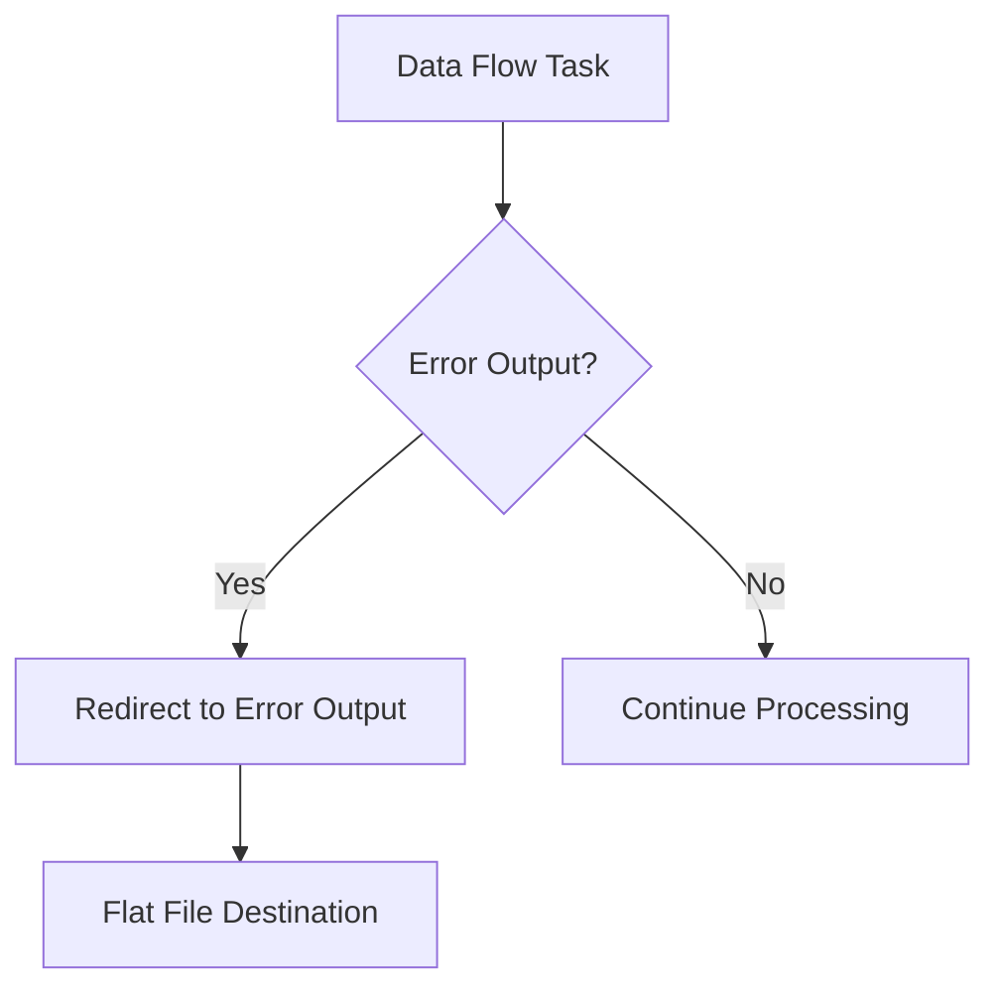

# Pre-requisites
- VS2019 community
- SQLServer Management Studio developer edition

# Business Request
The business has customer purchase data in local currency, but needs that data converted and needs the Customer contact information with it.
The purchase data is in SQL Server, the currency conversion data is in Excel, and the customer contact information is in a csv file.
You task is to bring this data together in a new SQL Server database for the business.
# 1. ETL Process Overview
The ETL process in SSIS consists of three main stages:

- **Extract**: Retrieve data from various sources like SQL Server, Excel, and flat files.
- **Transform**: Apply transformations such as data conversions and lookups.
- **Load**: Store the transformed data into a data warehouse.
  
# 2. SSIS Package Workflow
An SSIS package is divided into **Control Flow** and **Data Flow** components:

- **SSIS Package**: The overall container that includes all components.
- **Control Flow**: Manages the sequence of tasks (e.g., Execute SQL Task, Data Flow Task, Script Task, File System Task).
- **Data Flow**: A subsection of the Control Flow that manages the flow of data from sources to destinations, using transformations such as data conversions and lookups.
  
# 3. Control Flow vs. Data Flow
Control Flow and Data Flow are distinct components in SSIS. Below is a visual representation showing examples of each:

# 4. Connections in SSIS

SSIS uses various connection types to integrate with different data sources:

- **OLE DB Connection**: For SQL Server databases.
- **Excel Connection**: To read from or write to Excel files.
- **Flat File Connection**: To handle CSV or text files.

Connections are used within the Data Flow to connect **Sources** and **Destinations**.

## 5. Error Handling in SSIS

Error handling is critical in SSIS to maintain data quality. The diagram below shows how to handle errors in a Data Flow Task:

- **Error Output**: Errors are redirected to an output path for further review.
- **Flat File Destination**: Failed rows are saved for analysis.
    
# Pipline

# Data flow & Transformation 

# Deployment

# API Call for Currency Conversion

