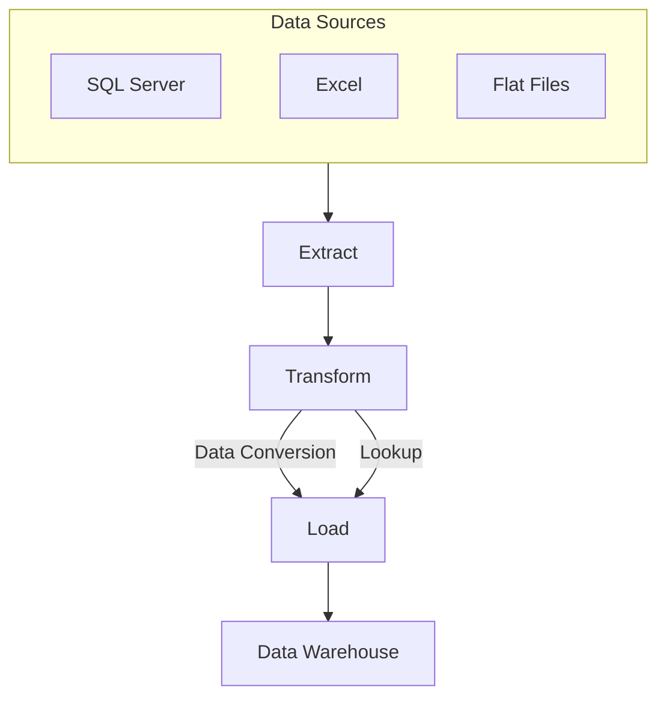

# Pre-requisites
- VS2019 community
- SQLServer Management Studio developer edition

# Business Request
The business has customer purchase data in local currency, but needs that data converted and needs the Customer contact information with it.
The purchase data is in SQL Server, the currency conversion data is in Excel, and the customer contact information is in a csv file.
You task is to bring this data together in a new SQL Server database for the business.
# 1. ETL Process Overview
The ETL process in SSIS consists of three main stages:

- **Extract**: Retrieve data from various sources like SQL Server, Excel, and flat files.
- **Transform**: Apply transformations such as data conversions and lookups.
- **Load**: Store the transformed data into a data warehouse.
  
# Pipline

# Data flow & Transformation 

# 1. ETL Process Overview
The ETL process in SSIS consists of three main stages:

- **Extract**: Retrieve data from various sources like SQL Server, Excel, and flat files.
- **Transform**: Apply transformations such as data conversions and lookups.
- **Load**: Store the transformed data into a data warehouse.
# Deployment

# API Call for Currency Conversion

